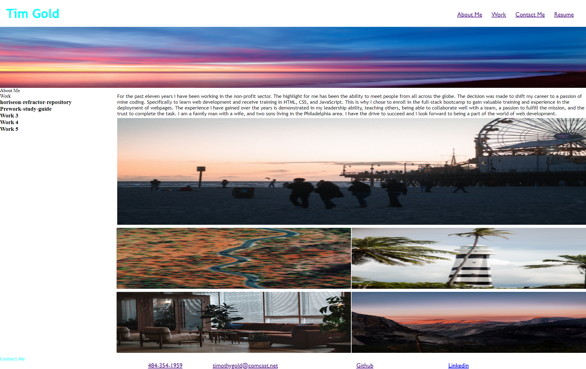

# Tim-Gold-Portfolio

## Description
My motivation for this portfolio was to build a site that could showcase my work and have links to reach out to me. This is a portfolio that shows my projects and websites that I have deployed. The about me section gives you a brief summary of who I am and why I am choosing web development as a career. My work will give you the ability to see what I have been coding. There is contact information with my email, phone number, github page, and my linkedin. 

##Instructions
Use the Github link and the Linkedin link. As I add more deployed projects there will be more links. 

##Collaborators
N/A

##License
N/A